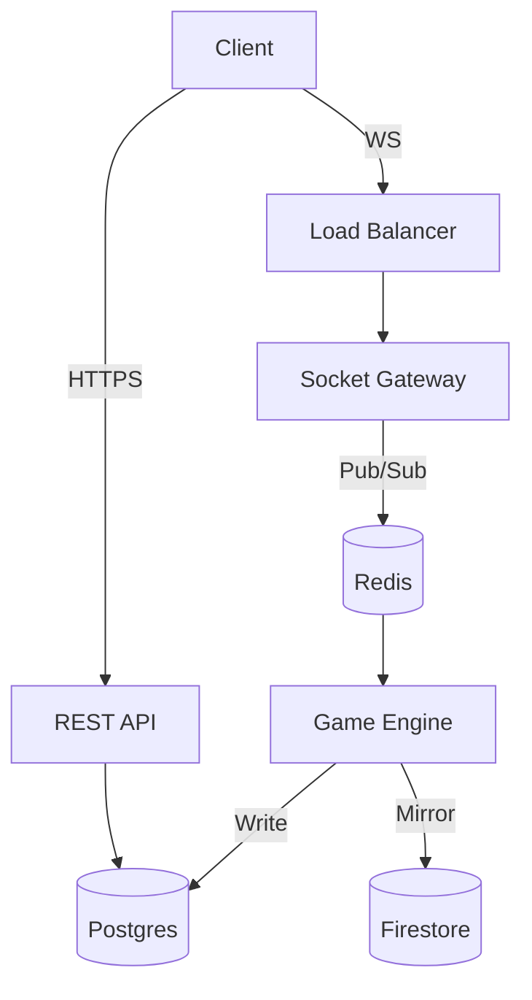

# Full Stack Tech Blueprint: Sindhi Patta (29 Cards) Platform

## Product Scope & Game Modes

**Sindhi Patta (29 Cards)** is a multiplayer skill-based card game platform designed as a multi-tenant, white-label SaaS.

*   **Core Experience:** 6-player tables, server-authoritative logic, real-time betting.
*   **Room Types:**
    *   **Classic Chaal Room:** Hidden cards, blind bets, `Chaal` (raise), `Pack` (fold), `Side Show` (compare with previous player).
    *   **Cold Soul Room:** Open cards, fixed entry (boot), single-shot winner evaluation (no betting rounds).
*   **Platform Features:** Hierarchy (Super Admin > Panel > Broker > Player), Wallet/Ledger system, Configurable commission (Null deducted).

---

## Canonical Rules (Normal + Festival)

### Deck Composition
*   **Total:** 29 Cards.
*   **Ranks:** 2, 3, 4, 5, 6, 7, 8 (All 4 Suits) + **9 of Hearts** (9H).
*   **Suit Order (Tie-breaker):** Hearts > Spades > Diamonds > Clubs.

### Hand Ranking (Highest to Lowest)

#### 1. Normal Mode
1.  **Trail (Set/Trio):** Three cards of same rank.
    *   *Order:* 9H-*-* (Theoretical max if multi-deck, else N/A) > 8-8-8 > 7-7-7 ... > 2-2-2.
2.  **9-Completion (The "Sindhi"):** Any 3 cards summing to exactly **9**.
    *   *Valuation:* Face value (9H = 9).
    *   *Tie-Breaker:* Highest single card rank. If equal, Suit of highest card.
    *   *Example:* `5H-2S-2D` (Sum 9, High 5) beats `4S-3D-2C` (Sum 9, High 4).
3.  **High Card:**
    *   *Order:* 9H > 8 > 7 > 6 > 5 > 4 > 3 > 2.
    *   *Tie-Breaker:* Compare 2nd highest, then 3rd, then Suit of highest.

#### 2. Festival Mode
*Trigger:* Occurs immediately next hand after a **Trail** is won.
*Cycle:* 4 Phases.

*   **Phase 1: 4-Card Deal**
    *   Deal 4 cards. Player discards 1.
    *   *Goal:* Best Normal Mode hand (Trail > 9-Comp > High).
*   **Phase 2: Imaginary Completion**
    *   Deal 2 cards.
    *   *Logic:* Can an imaginary 3rd card `X` (where `X` ∈ Deck) make Sum = 9?
    *   *Yes:* Hand Rank = 9-Completion (Virtual).
    *   *No:* Hand Rank = High Card (Sum of 2).
*   **Phase 3: Lowest Wins**
    *   Deal 3 cards.
    *   *Goal:* Lowest Sum wins. (A-2-3 is not possible, lowest is 2-2-2 = 6).
*   **Phase 4: Joker Variation**
    *   *Joker Rank* = `(Triggering Trail Rank) + 1` (Wrap 8->2).
    *   *Effect:* Joker cards count as **0**.
    *   *Goal:* Lowest Sum wins.

---

## Service Architecture

### Microservices Strategy
Deployed as **Google Cloud Run** services (stateless containers).

1.  **Auth Service (`auth-svc`)**
    *   **Role:** Tenant resolution, Identity (Phone/OTP), JWT minting, RBAC enforcement.
    *   **Multi-tenancy:** Extracts `X-Tenant-ID` header, validates against `tenants` table.
2.  **Gateway Service (`socket-gw`)**
    *   **Role:** WebSocket termination, sticky sessions (via LB cookies or Redis routing), protocol validation.
    *   **Tech:** Node.js + `uWebSockets.js` (High perf).
3.  **Game Engine (`game-engine`)**
    *   **Role:** The "Brain". Inputs -> State Machine (XState) -> Outputs.
    *   **Isolation:** 1 Worker per Table (Logical) or Sharded by TableID.
4.  **Wallet Service (`wallet-svc`)**
    *   **Role:** Double-entry ledger, fund locking, commission calculation.
    *   **Queue:** BullMQ (Redis) for serializing wallet ops per user.
5.  **Room Manager (`room-svc`)**
    *   **Role:** Matchmaking, table lifecycle, config distribution.

---

## Realtime Architecture

### Hybrid Strategy: WebSocket + Firestore Mirror
1.  **Hot Path (Latency Sensitive):**
    *   Client sends `Move` -> `Socket GW` -> `Redis Pub/Sub` -> `Game Engine`.
    *   `Game Engine` -> `Redis Pub/Sub` -> `Socket GW` -> Client.
    *   *Latency:* ~50-100ms.
2.  **Cold Path (Reliability/Replay):**
    *   `Game Engine` asynchronously writes final state of every turn to **Firestore**.
    *   *Structure:* `tenants/{tenantId}/tables/{tableId}/hands/{handId}`.
    *   *Use Case:* Client reconnects, Spectators, Audit logs, Admin dashboard.

---

## Data Architecture

### 1. PostgreSQL (Cloud SQL) - *Source of Truth*
*   **Tenants:** `id, domain, theme_config, admin_id`.
*   **Users:** `id, tenant_id, role, parent_id, wallet_balance`.
*   **Ledger:** `id, user_id, amount, type, ref_id, balance_after`.
*   **Game_Archives:** `id, table_id, hand_json, winner_id` (Historical data).

### 2. Redis (Cloud Memorystore) - *Hot State*
*   **Game State:** `game:{tableId}` -> JSON blob (Player cards, pot, turn).
*   **Locks:** `lock:table:{tableId}` (Redlock for concurrency).
*   **Pub/Sub:** Channels `room:{tableId}` for broadcasting.

### 3. Firestore - *Realtime View*
*   **Fanout:** Used for frontend state binding (optional) or just archival.
*   **Structure:**
    ```text
    /tenants/{tenantId}
      /active_tables/{tableId}  <-- Subscribed by Lobby
    ```

---

## Security Model

### 1. RNG & Shuffle Proof
To prevent "Rigged Deck" claims:
*   **Server Seed (`S`):** Generated at hand start. Hash `H(S)` sent to players.
*   **Client Seeds (`C1..C6`):** Players contribute entropy automatically.
*   **Nonce (`N`):** Hand number.
*   **Algorithm:**
    ```javascript
    const seed = HMAC_SHA256(serverSeed, clientSeeds.join("") + nonce);
    const deck = FisherYatesShuffle(baseDeck, seed);
    ```
*   **Verification:** Server reveals `S` at hand end. Client reconstructs deck locally.

### 2. RBAC (Role-Based Access Control)
*   **Super Admin:** Create Tenants, Global Config.
*   **Panel Admin:** Manage Brokers, View Tenant Analytics.
*   **Broker:** Create Players, Transfer Chips (In/Out).
*   **Player:** Play Game, View Own History.

### 3. Anti-Fraud
*   **Collusion Detection:** Flag IP matches at same table, GPS proximity (if mobile).
*   **Chip Dumping:** Monitor repetitive losses to specific player.

---

## API Contracts

### REST Endpoints (OpenAPI)

```yaml
GET /v1/tenants/config:
  headers: { "X-Domain": "poker.example.com" }
  response: { tenantId, branding, rules }

POST /v1/auth/login:
  body: { phone, otp, tenantId }
  response: { token, user: { role, balance } }

POST /v1/wallet/transfer:
  headers: { "Idempotency-Key": "uuid" }
  body: { toUserId, amount, note }
  
GET /v1/games/history:
  query: { page, limit }
```

### WebSocket Messages

**Wrapper:**
```json
{
  "type": "GAME_ACTION",
  "payload": { ... },
  "meta": { "reqId": "xyz" }
}
```

**Payloads:**

1.  **`JOIN_TABLE`**
    ```json
    { "tableId": "uuid", "seatIndex": 0 }
    ```
2.  **`PLAYER_MOVE`**
    ```json
    {
      "action": "CHAAL", // BLIND, PACK, SHOW, SIDE_SHOW
      "amount": 100,
      "targetSeat": 2 // For Side Show
    }
    ```
3.  **`GAME_UPDATE` (Server -> Client)**
    ```json
    {
      "state": "BETTING",
      "pot": 500,
      "turnSeat": 3,
      "players": [
        { "seat": 1, "status": "PLAYING", "balance": 900, "cards": ["HIDDEN", "HIDDEN", "HIDDEN"] }
      ],
      "lastAction": { "seat": 2, "action": "CHAAL", "amount": 50 }
    }
    ```

---

## Wallet & Ledger

### Transaction Boundaries
*   **Append-Only:** Never `UPDATE` balance. Always `INSERT` ledger row + atomic update of user summary.
*   **Idempotency:** Every game action (Bet) generates a deterministic UUID `hand_{id}_turn_{num}_seat_{num}`.
*   **Schema:**
    ```sql
    BEGIN;
      INSERT INTO ledger (user_id, amount, type, ref_id) VALUES (1, -100, 'BET', 'hand_1_turn_1');
      UPDATE users SET balance = balance - 100 WHERE id = 1;
    COMMIT;
    ```

---

## Multi-Tenancy & White-Label

### Strategy: Logical Isolation
*   **Database:** Single DB, all tables have `tenant_id` column. RLS (Row Level Security) in Postgres ensures query isolation.
*   **Frontend:**
    *   Wildcard Domain Mapping: `*.platform.com` or Custom Domains.
    *   `TenantConfig`: Fetched at boot based on hostname. Contains:
        *   `primaryColor`, `logoUrl`, `assetsPath`.
        *   `gameVariants` enabled.

---

## Deployment (Firebase/GCP)

### Stack
*   **Compute:** Cloud Run (Auto-scaling, Zero-maintenance).
*   **Database:** Cloud SQL (PostgreSQL 15).
*   **Cache:** Memorystore (Redis).
*   **Static Assets:** Firebase Hosting / Cloud Storage (CDN).
*   **Functions:** Firebase Cloud Functions (for async triggers like "Hand Finished" -> "Update Stats").

### Infrastructure as Code (Terraform)
```hcl
resource "google_cloud_run_service" "api" {
  name = "sindhi-patta-api"
  template {
    spec {
      containers {
        image = "gcr.io/prj/api:latest"
        env {
          name = "DB_HOST"
          value_from { secret_key_ref { name = "db-creds" } }
        }
      }
    }
  }
}
```

---

## Observability + SLOs

### Metrics (Prometheus/Stackdriver)
*   **SLO:** 99.9% Availability for Game Engine.
*   **Latency:** < 200ms P95 for WebSocket RTT.
*   **Business:** Active Tables, Total Pot/Min, Commission/Hour.

### Runbooks
*   **Alert:** `HighErrorRate` (> 1%)
    *   *Action:* Check Redis memory, Scale Cloud Run min instances.
*   **Alert:** `LedgerMismatch`
    *   *Action:* Trigger reconciliation script `npm run ledger:audit`.

---

## Testing Strategy

1.  **Unit:** Jest for Game Logic (Rule Engine).
    *   *Coverage:* 100% on Hand Ranking & Festival State Machine.
2.  **Property-Based:** `fast-check` to generate millions of random hands and verify:
    *   Winner is always correctly identified.
    *   Pot balance always sums to zero.
3.  **Integration:** Supertest for API + In-memory Redis.
4.  **Load:** `k6` script simulating 10k concurrent WebSocket players (Chaal/Pack loops).

---

## Assumptions & Open Questions

1.  **9-Completion Math:** Assumed strict summation. `5+2+2=9`.
2.  **Festival Trigger:** Assumed automatic transition. Does it require a vote? (Assumed No).
3.  **Broker Commission:** Assumed calculated post-game on the pot or pre-game on chip sales? (Assumed "Null deducted from pot" means House Rake from pot).
4.  **Disconnect Handling:** If a player disconnects, do they Auto-Pack or Auto-Check? (Assumed Auto-Pack after timeout).

---

## Recommended Repo Structure

```text
/
├── apps
│   ├── api          # Express/NestJS REST API
│   ├── realtime     # WebSocket Gateway
│   ├── engine       # Game Logic Worker
│   └── web          # Next.js Client
├── libs
│   ├── game-logic   # Shared Types/Rules (Normal + Festival)
│   ├── db           # Prisma/TypeORM Schema
│   └── redis        # PubSub & Locking wrappers
├── infra            # Terraform & Dockerfiles
└── tests            # E2E & Load tests
```

## Minimal Architecture Diagram


